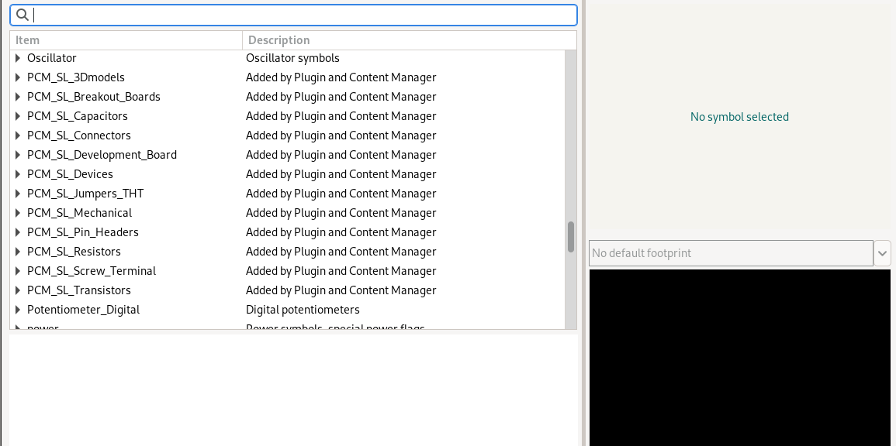

       

# **KiCad Simple Libraries**

##  **Introduction**
---

Simple Libraries KiCAD library pack is a collection of common electronic components libraries for the free and open-source KiCAD PCB design software. The goal of Simple Libraries is to provide a user-friendly library package for beginners. Components like resistors and capacitors are name base on the values like 10k,100ohm, 22uF… So users can directly search for the value and directly add it to their design. Most of the footprints and the 3D models are directly linked to KiCAD’s default libraries. So users can still use KiCAD,s official footprints, and 3D models.  

## **Requirements**
---
- You need to have a KiCAD version 7 or above. If not, install the latest KiCAD version from <a href="https://www.kicad.org/download/">here</a>.

- Required to have default(official) KiCAD libraries installed in KiCAD. Because some symbols in Simple Libraries KiCAD Libraries are linked to KiCAD default libraries.

- Need to have 200MB of disk space.

## **How to install 📜**
---

The Simple Libraries KiCAD libraries can be installed through **📦 PCM(Pluging and Content Manager)** in KiCAD.

1. Open the PCM and go to the Libraries section, Then search for Simple Libraries. Click the install button. To apply the changes Click the Apply Changes button in the PCM. 

2. Go to installed tab at the top and check whether the libraries are installed. 

     

3. **Restart KiCAD** after installing the library package. 

### Congratulations... You had successfully Installed the Simple Libraries KiCAD library pack.

To check whether all the symbol libraries are installed correctly, open the schematic editor and go to Add Symbole command. Then scroll through the list of libraries and see whether the following libraries are in the list. 

- PCM_SL_3Dmodels
- PCM_SL_Breakout_Boards
- PCM_SL_Capacitors
- PCM_SL_Connectors
- PCM_SL_DevelopmentBoards
- PCM_SL_Devices
- PCM_SL_Jumpers_THT
- PCM_SL_Mechanical
- PCM_SL_PinHeaders
- PCM_SL_Resistors
- PCM_SL_Transistors

 

To check whether all the footprint libraries are installed correctly. Go to the Footprint Editor and find similar libraries to symbol library names in the Library panel as shown in the following image. 

 

If all the libraries are installed correctly you can now browse through the components in the Simple Libraries. To learn about the components in the Simple Libraries KiCAD Library pack see what’s in this library section. 

##  **What’s in this library pack?**
---

Simple Library pack was created to make the adding components to the project easy. This library pack contains value-based component libraries. For example, if you need to add a 10k resistor to the schematic just type 10k on the search bar and you will get a 10k resistor with the value on it.  Just like that, we can search for common capacitors and crystal oscillators based on their values. When selecting footprints to the symbol only the commonly used packages are filtered. Which makes the footprint selection process easy. If you cannot find the value or footprint you are looking for, You can add the common component symbol from the default KiCAD libraries and change the value and the footprint accordingly. 

 

Simple Libraries contain symbols for some common connectors like Pinheaders male and female,  JST connectors, and Terminal Block connectors. This allows the user to search the name directly and get the symbol and the footprint need for the project. 

Simple Libraries KiCAD library pack also contains some development board and breakout board libraries with 3D models for some of the packages.  

All the components in the Simple Libraries are listaed below. 

 <table>
   <thead>
    <tr>
     <th colspan="3" rowspan="1"><b>KiCad Simple Libraries List</b></th>
    </tr>
   </thead>
   <tbody>
    <tr>
     <td><strong>PCM_SL_Devices</strong></td>
     <td>
     <ul>
       <li>
Buzzer_5v
</li>
       <li>
Crystal_8MHz - 24MHz
</li>
       <li>
Crystal 32.768kHz
</li>
       <li>
IC DIP Package 8,14,16
</li>
       <li>
LED 5mm, 3mm, 8mm, 10mm
</li>
        <li>
Push Button
</li>
       <li>
Potentiometer RM065, 3362P, RK163
</li>
       <li>
Resistor 0.5W, 1W, 5W, 10W
</li>
       
  

    </tr>
    <tr>
     <td><strong>PCM_SL_Capacitors</strong></td>
     <td>
     <ul>
       <li>
1uF to 4700uF
</li>
    </tr>
    <tr>
     <td><strong>PCM_SL_Resistors</strong></td>
     <td>
     <ul>
       <li>
0 ohm to 10M
</li>
    </tr>
    <tr>
     <td><strong>PCM_SL_Transistors</strong></td>
     <td>
     <ul>
       <li>
BC108
</li>
       <li>
C828
</li>
       <li>
D313
</li>
       <li>
D400
</li>
    </tr>
    <tr>
     <td><strong>PCM_SL_Connectors</strong></td>
     <td>
     <ul>
       <li>
JST Pin 02 -10
</li>
       <li>
Servo Ports pin 01 - 08
</li>
    </tr>
    <tr>
    <td><strong>PCM_SL_PinHeaders</strong></td>
     <td>
     <ul>
       <li>
Pinheaders Male 1x1 - 1x20
</li>
       <li>
Pinheaders Female 1x1 - 1x20
</li>
       <li>
Pinheaders Male 2x1 - 1x5
</li>
       <li>
Pinheaders Female 2x1 - 1x5
</li>
    </tr>
    <tr>
    <td><strong>PCM_SL_Screw_Terminal</strong></td>
     <td>
     <ul>
       <li>
Screw Terminal P5.00mm Pin  2 - 9
</li>
       <li>
Screw Terminal P3.5mm Pin  2 - 9
</li>
    </tr>
    <tr>
    <td><strong>PCM_SL_Jumpers_THT</strong></td>
     <td>
     <ul>
       <li>
Jumpers from 10mm - 120mm
</li>
    </tr>
    <tr>
     <td><strong>PCM_SL_DevelopmentBoards</strong></td>
     <td>
     <ul>
       <li>
Arduino Pro Mini
</li>
       <li>
ESP32 CAM
</li>
       <li>
ESP32 DevKit V1 DOIT 30GPIOs 🆕
</li>
       <li>
ESP32 DevKit V1 DOIT 32GPIOs 🆕
</li>
       <li>
Lolin NodeMCU ESP8266 V3
</li>
       <li>
Rasberry Pi Pico
</li>
       <li>
Blue Pill DevBoard
</li>   
    </tr>
    <tr>
         <td><strong>PCM_SL_Breakout_Boards</strong></td>
     <td>
     <ul>
       <li>
A4988
</li>
       <li>
HC-05 Bluetooth Module🆕
</li>
       <li>
HC-06 Bluetooth Module
</li>
       <li>
HC SR04 Ultrasonic Sensor
</li>
       <li>
LCD 16x4
</li>
       <li>
MPU6050🆕
</li>
       <li>
PIR Sensor
</li>
    </tr>
     </tbody>
  </table>

 This work is licensed under a <a rel="license" href="http://creativecommons.org/licenses/by-sa/4.0/">Creative Commons Attribution-ShareAlike 4.0 International License</a>.
